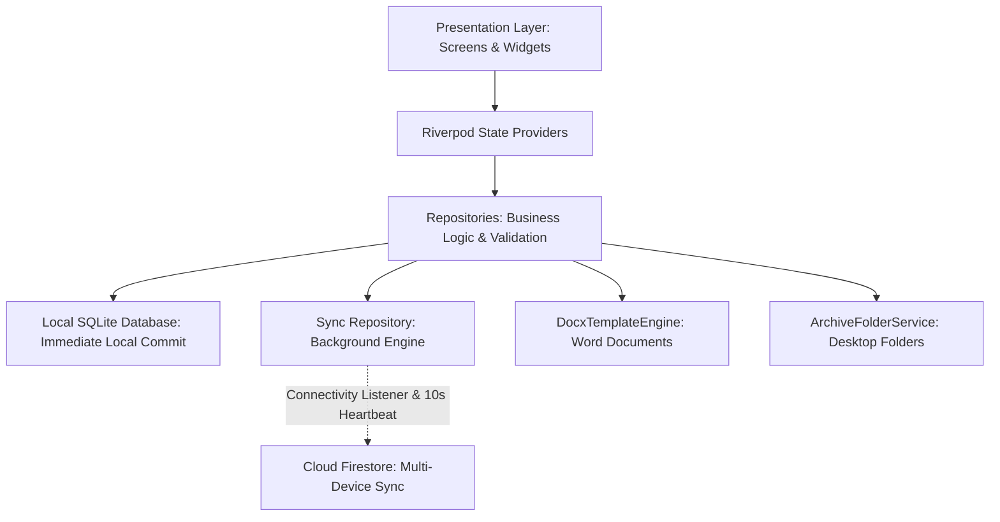

# دليل الهندسة البرمجية وشرح الشيفرة الكامل (Architecture & Codebase Comprehensive Guide)
## تطبيق إدارة عقود الزواج والوكالات الشرعية (Marriage & Agency Management System)

---

## فهرس المحتويات (Table of Contents)
1. [نظرة عامة على النظام والمعمارية البرمجية (System Architecture Overview)](#1-نظرة-عامة-على-النظام-والمعمارية-البرمجية)
2. [هيكلية المجلدات والملفات (Directory Structure Breakdown)](#2-هيكلية-المجلدات-والملفات)
3. [طبقة البيانات وقاعدة البيانات المحلية (Local-First SQLite & DAO Layer)](#3-طبقة-البيانات-وقاعدة-البيانات-المحلية)
4. [محرك المزامنة التلقائية والعمل بدون إنترنت (Offline-First & Auto-Sync Engine)](#4-محرك-المزامنة-التلقائية-والعمل-بدون-إنترنت)
5. [الربط التبادلي التلقائي بين التسليم والحالة (Bidirectional Delivery ⟷ Status Sync)](#5-الربط-التبادلي-التلقائي-بين-التسليم-والحالة)
6. [محرك إنشاء مستندات الوورد ومعالجة الـ UTF-8 (Word .docx Generation Engine)](#6-محرك-إنشاء-مستندات-الوورد-ومعالجة-الـ-utf-8)
7. [تقنية التنقل باللوحة المفاتيح عبر زر Enter/Return (Keyboard Flow & Tab Stepping)](#7-تقنية-التنقل-باللوحة-المفاتيح-عبر-زر-enterreturn)
8. [واجهة المستخدم والتصميم البصري عالي التباين (UI Components & Design System)](#8-واجهة-المستخدم-والتصميم-البصري-عالي-التباين)
9. [إدارة الحالة بواسطة Riverpod (State Management)](#9-إدارة-الحالة-بواسطة-riverpod)
10. [خدمات الأرشيف ومجلدات سطح المكتب (Archive & Desktop Integration)](#10-خدمات-الأرشيف-ومجلدات-سطح-المكتب)

---

## 1. نظرة عامة على النظام والمعمارية البرمجية
تم تصميم التطبيق وفق معمارية **المعمارية النظيفة (Clean Architecture / Feature-First Architecture)** مع تبني نهج **المحلي أولاً (Local-First Design)**.



### لماذا تم اختيار هذه المعمارية؟
1. **السرعة الفائقة وانعدام التعليق (Zero Latency UI):**
   - المأذون الشرعي يحتاج لإدخال العقود والوكالات بسرعة. إذا تم ربط الحفظ بشبكة الإنترنت، فإن أي بطء أو انقطاع سيجعل التطبيق يتجمد.
   - عبر **SQLite المحلية**، يستغرق الحفظ أقل من **5ms**، وتعمل المزامنة في الخلفية دون تعطيل المستخدم.
2. **استقلالية الخصائص (Feature Encapsulation):**
   - كل ميزة (`marriages` و `agencies`) مستقلة بنماذجها، وعمليات قواعد البيانات (`DAO`)، وشاشاتها، مما يمنع التداخل البرمجي ويسهل الصيانة.

---

## 2. هيكلية المجلدات والملفات

```text
lib/
├── core/                                # النواة المشتركة للتطبيق
│   ├── database/                        # إدارة اتصال وتهيئة SQLite محلياً
│   │   └── app_database.dart            # إنشاء الجداول، مؤشرات البحث FTS4، والترقيات
│   ├── notifications/                   # تنبيهات العقود غير المكتملة والنواقص
│   │   └── notification_service.dart    # فحص دوري للعقود المتأخرة وإرسال إشعارات
│   ├── sync/                            # محرك المزامنة بين SQLite و Firestore
│   │   ├── sync_repository.dart         # إدارة الدفع والسحب وفحص الاتصال
│   │   └── sync_status.dart             # التعدادات (Enums) لحالات المزامنة والملفات
│   ├── theme/                           # الهوية البصرية، الألوان، وأنماط الخطوط
│   │   └── app_theme.dart               # لوحة الألوان الزمردية وخط Cairo والتباين العالي
│   └── widgets/                         # العناصر المرئية العامة
│       ├── form_fields.dart             # حقول الإدخال، القوائم المنسدلة، ومنتقي التواريخ
│       ├── status_badge.dart            # شارات الحالات المصممة بتباين واضح
│       └── sync_indicator.dart          # مؤشر حالة المزامنة في الترويسة
├── features/                            # الميزات الرئيسية للتطبيق
│   ├── marriages/                       # ميزة عقود الزواج
│   │   ├── data/
│   │   │   ├── dao/marriage_dao.dart    # دوال الاستعلام والـ FTS4 في SQLite
│   │   │   ├── models/marriage_model.dart # نموذج البيانات والتحويل (Map/JSON/Firestore)
│   │   │   └── repositories/marriage_repository.dart # منطق الأعمال والتحقق
│   │   └── presentation/
│   │       ├── screens/                 # شاشات القائمة، الإدخال، والتفاصيل
│   │       └── widgets/                 # بطاقات التسليم وقوائم النواقص
│   └── agencies/                        # ميزة الوكالات الشرعية
│       ├── data/ (dao, models, repositories)
│       └── presentation/ (screens, widgets)
└── services/                            # الخدمات المتقدمة للنظام
    ├── folder_service/                  # إدارة المجلدات على نظام التشغيل (Windows / macOS)
    │   └── archive_folder_service.dart  # إنشاء وتنظيم مجلدات العقود على القرص
    └── word_engine/                     # محرك توليد وتعديل مستندات Word
        └── docx_template_engine.dart    # قراءة القالب، استبدال المتغيرات، وترميز UTF-8
```

---

## 3. طبقة البيانات وقاعدة البيانات المحلية (Local-First SQLite & DAO Layer)

### هيكل البيانات والتحويل (`MarriageModel`):
تم تصميم النماذج لتكون غير قابلة للتعديل المباشر (`Immutable`) وتعتمد على `copyWith`، مع توفير دوال تحويل دقيقة لكل من SQLite و Firestore:

```dart
class MarriageModel {
  final String id;
  final String recordNumber;
  final PersonInfo husband;
  final PersonInfo wife;
  final GuardianInfo guardian;
  final MahrInfo mahr;
  final List<WitnessInfo> witnesses;
  final ProcessingStatus processingStatus;
  final List<String> pendingFiles;
  final DeliveryInfo husbandDelivery;
  final DeliveryInfo wifeDelivery;
  final SyncStatus syncStatus;
  final DateTime lastStatusUpdate;
  final DateTime createdAt;
  ...
}
```

### البحث الفائق باللغة العربية عبر FTS4:
تم تضمين جدول بحث بالنص الكامل (`marriages_fts` و `agencies_fts`) داخل SQLite لدعم البحث الفوري عن أي اسم أو رقم عقد أو رقم هوية في أجزاء من الألف من الثانية:

```sql
CREATE VIRTUAL TABLE IF NOT EXISTS marriages_fts USING fts4(
  content="marriages",
  id,
  record_number,
  husband_name,
  wife_name,
  guardian_name,
  husband_id_number,
  wife_id_number
);
```

---

## 4. محرك المزامنة التلقائية والعمل بدون إنترنت (Offline-First & Auto-Sync Engine)

### دورة حياة المزامنة (`SyncRepository`):

```text
[ المستخدم ينشئ/يعدل عقداً ]
         │
         ▼
[ كتابة فورية في SQLite ] ──► حالة السجل: pending_upload أو pending_update
         │
         ├───► [ إذا كان الإنترنت مقطوعاً ] ──► يحتفظ بالسجل محلياً بأمان تام.
         │
         └───► [ عند توفر / عودة الإنترنت ]
                    │
                    ├── 1. مستشعر ConnectivityPlus يكتشف الاتصال فوراً.
                    ├── 2. مؤقت نبضات المزامنة (Heartbeat Timer - 10s) يفحص السجلات المعلقة.
                    ├── 3. تنفيذ Batch Push لجميع التعديلات إلى Firestore.
                    └── 4. تحديث حالة السجلات المحلية إلى 'synced'.
```

### كود معالجة المزامنة والنبضات الدورية:
```dart
// Periodic Heartbeat Sync (كل 10 ثوانٍ لفحص ورفع أي سجلات معلقة)
_heartbeatTimer = Timer.periodic(const Duration(seconds: 10), (_) async {
  await pushPendingChanges();
});

// دفع السجلات المعلقة كدفعة واحدة (Batch)
Future<void> pushPendingChanges() async {
  if (_isSyncing) return;
  final pendingMarriages = await _marriageDao.getPendingSync();
  final pendingAgencies = await _agencyDao.getPendingSync();

  if (pendingMarriages.isEmpty && pendingAgencies.isEmpty) return;

  _isSyncing = true;
  _syncStateController.add(SyncState.syncing);

  try {
    if (pendingMarriages.isNotEmpty) {
      await _pushMarriages(pendingMarriages).timeout(const Duration(seconds: 5));
    }
    if (pendingAgencies.isNotEmpty) {
      await _pushAgencies(pendingAgencies).timeout(const Duration(seconds: 5));
    }
    _isOnline = true;
    _syncStateController.add(SyncState.synced);
  } catch (e) {
    _isOnline = false;
    _syncStateController.add(SyncState.offline);
  } finally {
    _isSyncing = false;
  }
}
```

### حماية التعديلات المحلية (Local Conflict Protection):
عند وصول تحديثات جديدة من السحابة، يمنع التطبيق استبدال أي سجل محلي إذا كان المستخدم قد عدله بدون إنترنت ولم يُرفع بعد:
```dart
final local = await _marriageDao.getById(docId);
if (local != null &&
    (local.syncStatus == SyncStatus.pendingUpload ||
     local.syncStatus == SyncStatus.pendingUpdate ||
     local.syncStatus == SyncStatus.pendingDelete)) {
  continue; // حماية التعديل المحلي وعدم مسحه
}
```

---

## 5. الربط التبادلي التلقائي بين التسليم والحالة (Bidirectional Delivery ⟷ Status Sync)

تم تضمين منطق عمل ذكي ثنائي الاتجاه داخل طبقة المستودع (`MarriageRepository` و `AgencyRepository`):

### القواعد المنطقية المطبقة:
1. **التسليم ➔ الإكمال:** إذا تم تفعيل تسليم النسختين معاً (`husbandDelivery.isDelivered && wifeDelivery.isDelivered`)، تصبح الحالة تلقائياً **`مكتمل` (Completed)**.
2. **الإكمال ➔ التسليم:** إذا قام المستخدم باختيار الحالة **`مكتمل`** (من شارة الحالة أو القائمة المنسدلة)، يتم تفعيل مفاتيح تسليم النسختين تلقائياً وتسجيل وقت وتاريخ التسليم.
3. **التراجع:** إذا تم إلغاء تفعيل تسليم إحدى النسخ، تعود الحالة تلقائياً إلى **`قيد الإجراء`** (أو **`ناقص وثائق`** إذا وجدت مستندات ناقصة).

```dart
// MarriageRepository.dart
Future<MarriageModel> update(MarriageModel marriage) async {
  final now = DateTime.now();
  ProcessingStatus newStatus = marriage.processingStatus;
  DeliveryInfo newHusbandDelivery = marriage.husbandDelivery;
  DeliveryInfo newWifeDelivery = marriage.wifeDelivery;

  // القاعدة 1: اكتمال التسليم يغير الحالة إلى مكتمل
  if (newHusbandDelivery.isDelivered && newWifeDelivery.isDelivered) {
    newStatus = ProcessingStatus.completed;
  }
  // القاعدة 2: تغيير الحالة إلى مكتمل يفعل مفاتيح التسليم
  else if (newStatus == ProcessingStatus.completed) {
    if (!newHusbandDelivery.isDelivered) {
      newHusbandDelivery = newHusbandDelivery.copyWith(
        isDelivered: true,
        deliveredAt: newHusbandDelivery.deliveredAt ?? now,
      );
    }
    if (!newWifeDelivery.isDelivered) {
      newWifeDelivery = newWifeDelivery.copyWith(
        isDelivered: true,
        deliveredAt: newWifeDelivery.deliveredAt ?? now,
      );
    }
  }
  // القاعدة 3: إلغاء التسليم يعيد الحالة السابقة
  else if (newStatus == ProcessingStatus.completed &&
      (!newHusbandDelivery.isDelivered || !newWifeDelivery.isDelivered)) {
    newStatus = marriage.pendingFiles.isNotEmpty
        ? ProcessingStatus.missingFiles
        : ProcessingStatus.inProgress;
  }
  ...
}
```

---

## 6. محرك إنشاء مستندات الوورد ومعالجة الـ UTF-8 (Word .docx Generation Engine)

### طبيعة ملفات Word `.docx`:
ملف الـ `.docx` في الحقيقة هو أرشيف مضغوط بتنسيق **ZIP** يحتوي على ملفات XML، وأهمها `word/document.xml`.

### كيف تم حل مشكلة تشوه النصوص العربية وتجزئة الوسوم؟
1. **استخدام الترميز الكامل `utf8.decode` و `utf8.encode`:**
   - النصوص العربية في Dart تتطلب تشفيراً متعدد البايتات (Multi-byte UTF-8). استخدام `codeUnits` العادي يقتطع البايتات بنظام 8-bit مما يتلف الأحرف. تم استخدام `utf8.decode` لقراءة الـ XML و `utf8.encode` لإعادة كتابته.
2. **تنظيف تجزئة الوسوم عبر Regex:**
   - عند إنشاء قوالب في Word، يقوم المحرر بتقسيم العبارات مثل `{{HUSBAND_NAME}}` إلى عدة وسوم `<w:r><w:t>{{</w:t></w:r><w:r><w:t>HUSBAND_NAME}}</w:t></w:r>`.
   - تم بناء تعبير نمطي ذكي يقوم بحذف أي وسوم XML تفصل بين أقواس المتغيرات ليتم استبدالها بنجاح:

```dart
// docx_template_engine.dart
String xmlContent = utf8.decode(file.content as List<int>);

// دمج الوسوم المجزأة داخل الأقواس {{...}}
xmlContent = xmlContent.replaceAllMapped(
  RegExp(r'(\{\{[^}]*?<[^>]+>[^}]*?\}\})'),
  (m) => m.group(0)!.replaceAll(RegExp(r'<[^>]+>'), ''),
);

// استبدال المتغيرات بالنصوص العربية الآمنة
for (final entry in placeholders.entries) {
  final key = entry.key;
  final val = _escape(entry.value);
  xmlContent = xmlContent.replaceAll('{{$key}}', val);
}

final newBytes = Uint8List.fromList(utf8.encode(xmlContent));
```

---

## 7. تقنية التنقل باللوحة المفاتيح عبر زر Enter/Return (Keyboard Flow & Tab Stepping)

لتوفير تجربة إدخال سريعة جداً للمأذون على أجهزة سطح المكتب (Windows / macOS):

### 1. الانتقال التلقائي بين الحقول (`FocusScope.nextFocus`):
كل حقل نصي مبرمج ليعمل مع `textInputAction: TextInputAction.next` وينقل التركيز للحقل التالي عند الضغط على `Enter`.

### 2. الانتقال التلقائي للتبويب التالي عند نهاية التبويب:
في الحقل الأخير من كل تبويب، يتم تمرير دالة `onSubmitted: (_) => _nextTab()` لينتقل النموذج فورياً إلى الصفحة التالية.

```dart
class _Field extends StatelessWidget {
  const _Field({
    required this.label,
    required this.ctrl,
    this.textInputAction,
    this.onSubmitted,
  });

  @override
  Widget build(BuildContext context) {
    return TextFormField(
      controller: ctrl,
      textInputAction: textInputAction ?? TextInputAction.next,
      onFieldSubmitted: (val) {
        if (onSubmitted != null) {
          onSubmitted!(val);
        } else {
          FocusScope.of(context).nextFocus();
        }
      },
      ...
    );
  }
}
```

### 3. الحماية من أخطاء الـ `TabController`:
تم حماية أزرار التنقل وتحديد التبويبات باستخدام `AnimatedBuilder` وقص المؤشرات عبر `.clamp(0, length - 1)` لمنع أي انهيار في التطبيق عند النقر السريع.

---

## 8. واجهة المستخدم والتصميم البصري عالي التباين (UI Components & Design System)

### 1. نظام الألوان والخطوط (`AppTheme`):
- **الخط الأساسي:** خط `Cairo` العربي الأنيق بجميع أوزانه.
- **لون السطح والنصوص:** تم اعتماد لون الفحم الداكن `#1A1C1A` ولون الغابة الداكن `#2E3D34` للنصوص وعناوين الحقول، لضمان قراءة فائقة الوضوح ومنع مشكلة النصوص البيضاء على خلفيات فاتحة.
- **شارة الحالات (`StatusBadges`):** تعتمد على درجات مشبعة وواضحة مع حدود ملونة ونص أسود داكن.

### 2. تجميع البيانات المنطقي في صفحة التفاصيل (`Grouped Sub-sections`):
تم تنظيم شاشات التفاصيل داخل بطاقات قابلة للطي (`_CollapsibleSection`) مع تقسيمها لمجموعات فرعية مفصولة بخطوط أنيقة:
- **البيانات الشخصية** (الاسم الرباعي، الجنسية، الحالة الاجتماعية، اسم الأم).
- **بيانات الهوية والميلاد والإقامة** (نوع ورقم الهوية، جهة وتاريخ الإصدار، محل الميلاد والإقامة).
- **التعليم والمهنة** (المستوى التعليمي، المهنة).
- **بطاقات التسليم المتجاورة (`Row`)** لنسخة الزوج ونسخة الزوجة.

---

## 9. إدارة الحالة بواسطة Riverpod (State Management)

تم استخدام **Riverpod 2.x** لأنه يوفر:
1. **انعدام الاعتماد على `BuildContext`** في طبقة البيانات، مما يسمح بعمل المزامنة حتى عند إغلاق الشاشات.
2. **التحديث التلقائي للواجهات (`Reactive State`)**:
   - `marriageListProvider` يستمع لأي تغييرات محلية في قاعدة البيانات ويعيد رسم القوائم فوراً.
   - `syncStateProvider` يراقب حالة الاتصال والسحابة لتحديث أيقونة المزامنة في الوقت الفعلي.

---

## 10. خدمات الأرشيف ومجلدات سطح المكتب (Archive & Desktop Integration)

يقوم `ArchiveFolderService` بتنظيم ملفات ومستندات كل عقد في مجلد خاص به على جهاز الكمبيوتر:

```text
📁 مستندات المأذون الشرعي/
   ├── 📁 عقود الزواج/
   │   └── 📁 عقد_101_أحمد_محمد_علي/
   │       ├── 📄 عقد_زواج_101.docx
   │       └── 📄 إفادة_زواج_101.docx
   └── 📁 الوكالات/
       └── 📁 وكالة_201_توكيل_عام/
           └── 📄 وكالة_201.docx
```

ويتم فتح المجلد تلقائياً عبر مستكشف ملفات النظام (`Finder` على macOS أو `File Explorer` على Windows) بضغطة زر واحدة.

---

## الخلاصة
يجمع هذا التطبيق بين:
- **سرعة وكفاءة العمل المكتبي (Desktop-First / Keyboard-Optimized)**.
- **موثوقية العمل بدون إنترنت (Local-First Offline Architecture)**.
- **مرونة المزامنة السحابية متعددة الأجهزة (Cloud Firestore)**.
- **توليد الوثائق الرسمية الدقيقة (Word Automation)**.
- **تصميم بصري عربي احترافي عالي التباين والجمالية**.
